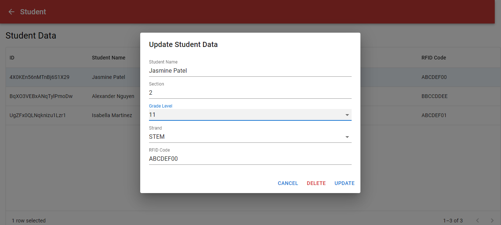
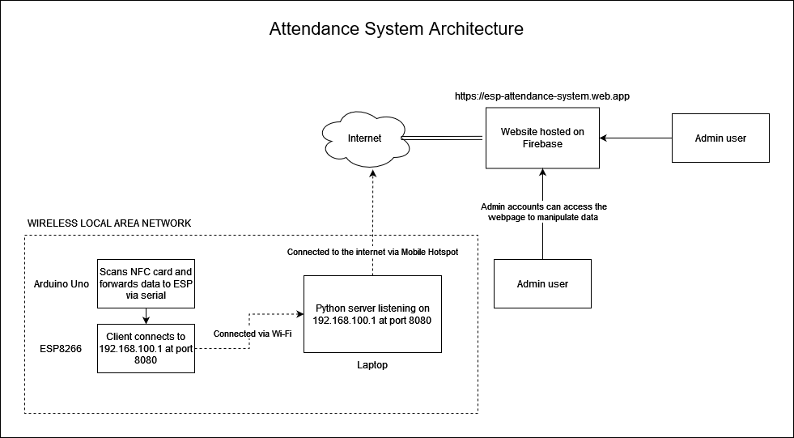

# About

Attendance System is a system for monitoring and managing attendance data of each student. The admin can read, create, update or delete student profile. The admin can also read, create, update or delete attendance data. The system uses Arduino Uno and ESP8266 to scan and process data from NFC cards then forwards them via Wi-Fi to a Python server running on a laptop. The server processes and makes an attendance data which contains the current time. The server then appends the attendance data to the students's attendance records where it contains all the student's previous attendance data.

## Functions

- Create, read, update, delete student profile
- Sort student profile data
- Create, read, update, delete attendance data
- Sort attendance data

## Quick Preview

    <h3>FRONT PAGE</h3>
    
    <h3>UPDATING STUDENT DATA</h3>
    

## Architecture

    

## Disclaimer

Information in the site such as name and other details is fictional and does not exists in real life. It's purpose is to provide dummy or test data for the website. The code included in this repository is only use for testing and demonstration purposes, the original code of the website is kept secret.
