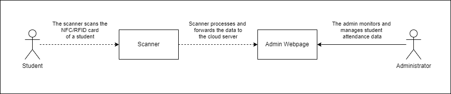
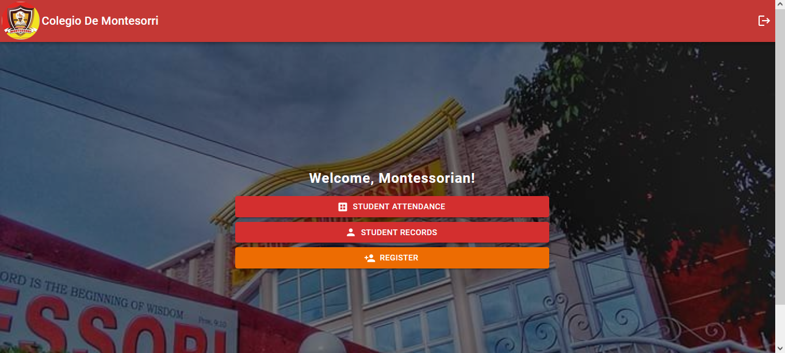
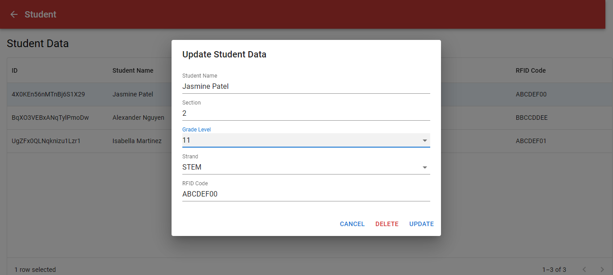
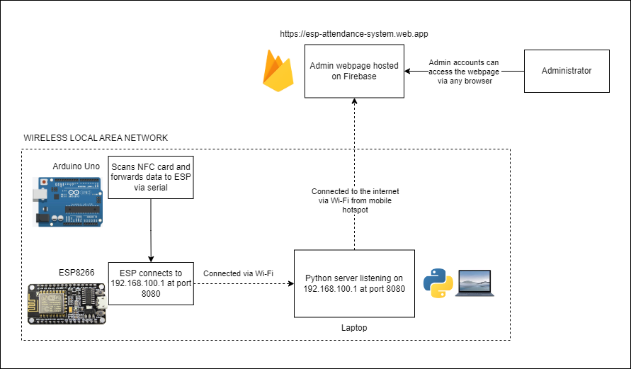
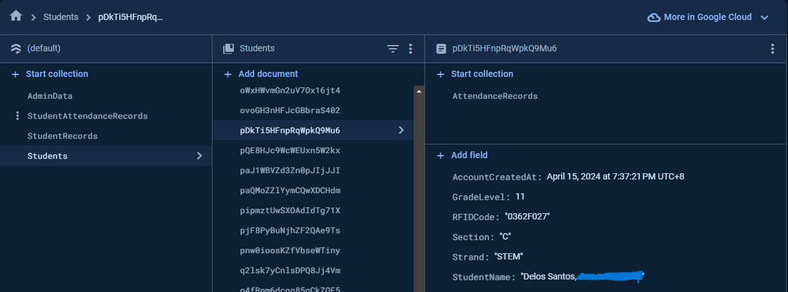
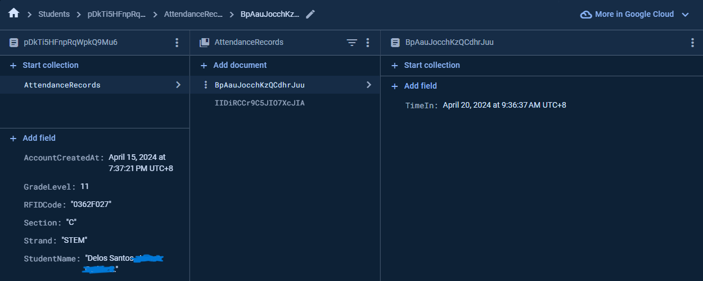

# About

The Arduino Attendance System is a solution designed to monitor and manage student attendance data efficiently. A group of Grade 12 researchers at Colegio de Montessori conducted a research project to explore the effectiveness of implementing RFID technology to enhance attendance monitoring for senior high school students. Their research findings demonstrated that using RFID technology significantly improved the accuracy and efficiency of attendance tracking in senior high school students at Colegio de Montessori. The research paper titled "Arduino Attendance System" can be found [here](https://docs.google.com/document/d/13zE2uM4QEevV3N0h9ipxSd4_QNjQAa9H1j9ltIhVOow/edit#heading=h.gjdgxs).

<h4>I managed the entire system, including the code, documentation, and the setup and administration of the Firebase cloud database. The researchers compensated me for my work on this project.</h4>

## How it works

<h4>Step by step procedure: </h4>
1. The student taps their NFC/RFID card on the scanner. 
2. The scanner reads and processes the UID of the card. 
3. The UID is forwarded to the cloud server. 
3. The updated data is displayed on the web page. 
4. The administrator reviews the new data. 

<h4>The hosting of webpage, authentication, and database are all managed on the cloud using Firebase.</h4>

## Administrative Actions

### Student data:

- Create student data profile
- Read student data profile
- Delete student data profile
- Update student data profile
- Sort student data profile

### Student attendance data

- Create student attendance data
- Read student attendance data
- Update student attendance data
- Delete student attendance data
- Sort student attendance data

<h4>Student data profiles include information about the student, such as their name, section, and strand. While student attendance data records the instances which includes a timestamp when a student taps their NFC/RFID card.</h4>

## Admin web page

### Front page

<h4>The system includes an authentication feature that requires users to enter a username and password before they can access the admin web page. The front page is displayed only after a successful login with the correct credentials.</h4>

### Updating student data

<h4>Only administrators who know the correct credentials can perform administrative actions on the data. When a request is made to the cloud server, the server checks and validates if the requests are coming from authenticated users.</h4>

## Architecture

The Arduino Uno connects to the ESP8266 using jumper wires for a serial connection. The ESP8266 connects to the laptop's Wi-Fi hotspot. A Python server on the laptop listens for incoming data from the ESP8266 at `192.168.100.1` on port `8080`. After processing the data, the Python server uploads it to the Firebase database. The information is then displayed on the admin webpage hosted on Firebase, allowing the administrator to view it.

<h4>The NFC/RFID reader in Arduino Uno reads the UID of the card. This UID is then sent to the Python server via ESP8266. The Python server uploads the attendance data to the cloud, which includes a timestamp that records the current date and time. The UID is used to get a document reference of a student in the database</h4>

## Firebase firestore database structure

### Student data profile

<h4>Database -> Students -> pDkTi5HFnpRqWpkQ9Mu6</h4>

Each individual student's profile data is stored within the "Students" collection. Each document in this collection includes fields about the student information such as their section, strand and rfid code. The field "RFIDCode" contains the UID of a physical NFC card, the UID is used to link an NFC card to a student.

<h4>The collections "StudentAttendanceRecord" and "StudentRecords" is used for testing purposes only and contains empty documents.</h4>

### Indiviual student attendance data

<h4>pDkTi5HFnpRqWpkQ9Mu6 -> AttendanceRecords -> BpAauJocchKzQCdhrJuu</h4>

Each document of attendance data is stored within the "AttendanceRecords" collection. Each document includes a "TimeStamp" field with a data type value of timestamp. This field contains the date and time when a student tapped their NFC/RFID card on the NFC/RFID reader.
